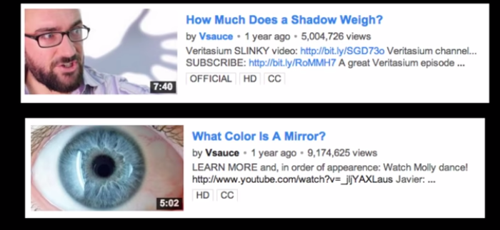

# 12. Knowing vs Understanding
Created Friday 12 February 2021

<https://www.youtube.com/watch?v=iatAob6f2uw&ab_channel=LoriStohs>

FIXME - always ask why, how and other questions, in the beginning itself. Don't be shy or give in to pessimsm. It's the best way to learn. You are happy and honest. Without the why, everything's boring, and there's no learning.

* Own your way of thinking, because it is who you are. <https://www.youtube.com/watch?v=_womFWYueQk>
* Keep asking questions, and be comfortable with doing so.
* Be brave, failure is OK. Learn and move.
* Don't conform. Question everything. Critical thinking, math and science should be the norm. We do all this to be happy.
* Your degree and grades don't define you, or your future. We can grow.
* This also helps in collaboration and bonding.

To do this, you need to find people who support you and are positive.
Find a mentor - someone who you can talk to and trust. It may not be permanent. We need to learn to be positive. Because negativity always looks true. Also, and we can be wrong.
See [Everyday thinking can tranform you](https://youtu.be/wxvl3uE6OnU?t=762)
[Keep asking why?](https://www.youtube.com/watch?v=u9hauSrihYQ)

* We have excelled by asking questions. We have truly become extraordinary.
* Also, my ability to use personal tags of people as hooks is great, I should do it more often. [Collect as many hooks as possible](https://youtu.be/u9hauSrihYQ?t=647)
* Saying: [Late realization is great](https://youtu.be/u9hauSrihYQ?t=823)
* [Questions may be unique to humans](https://youtu.be/u9hauSrihYQ?t=889)

"You are just your intelligence" - Kalpana Chawla

#### Communicate out
The best way to retain what you know, is to speak out to people. It is great fun. Your brain retains what you speak out. Surround yourself with people who support and are good. Don't worry about negative things, as long as you keep asking questions and they do the same.

#### Effects of asking

* Value of established things may be realized - like classical theorems, concepts
* New ideas are made 

