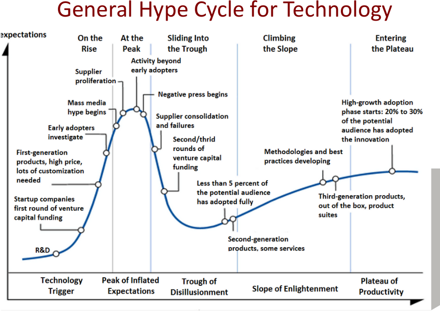

# 17. Deliberate mindset for a task
Created Wednesday 24 February 2021

Previously known as **"How to understand creepy stuff and keep going"**

Note: We are creating a per-task mindset here, and we can be fooled and bad things may be seen as good, even beneficial. Do this carefully, be honest and don't shun other ideas.

#### What this doesn't aim for

* Create justifications based on present needs, it makes a thing boring.
* This method should fail for provably bad/destructive ideas - e.g. genetic discrimination.
* To create justifications based on what an opponent is doing. Example - to study computers because the neigboring country is doing so.

#### What this aims for

* A fast way to clear intention and emotions.
* To get rid of hype, biases, prejudices, fear, societal pressure - in a graceful manner. I don't want to become demotivated or foolish.
* To gamify the task.
* To accumulate motivation, patience and a sense of happiness.

