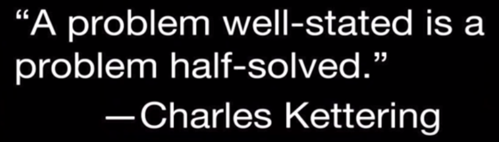

# 35. Emotion regulation basics
Created Tuesday 20 April 2021

**Retain this**: You are understanding emotions, working on yourself - this is a really great investment. You will learn to be happy. In short, H of HRF is being developed. You are not a time waster, you were just ill.

#### Situation
Hello Sanjar. You are very smart and lucky. You did another great thing, thanks to computer science.

* You were going through the same kind of emotions lots of times.
* They were not comfortable, so by default, you were processing them - i.e. finding their cause and then remedying them.
* After lots of work, you found out that you are reprocessing already known emotions. So you wished to keep them in a hashSet. **The better(precise) the [naming](https://youtu.be/PqDCnOmyA88)(id'ing), the better and faster the hashSet.**

Your idea is known [FIP](https://youtu.be/PqDCnOmyA88?t=420)(Feel, Id, Process). And the hashSet part is real.

Advantages: This will greatly reduce response time and will activate coping mechanisms. All in all, you'll function a lot better.

#### Emotional laws
<https://www.youtube.com/watch?v=gTZgfyOW-DA>

FIXME: some random <sourcehttps://markmanson.net/emotional-intelligence#emotional-intelligence>

